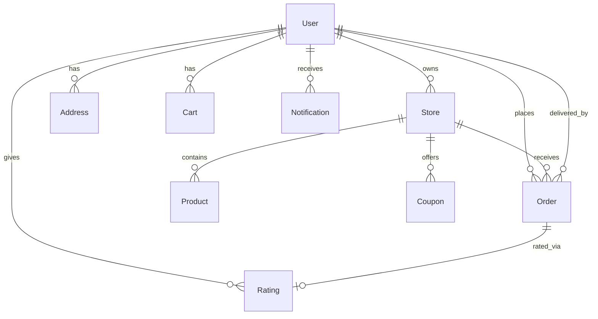

<p align="center">
  
</p>

<h1 align="center">🛒 QuickCart</h1>

<p align="center">
  <strong>A full-stack hyperlocal delivery platform built for speed.</strong><br/>
  Order groceries, food & medicines from local stores — delivered in minutes.
</p>

<p align="center">
  
  
  
  
  
  
</p>

<p align="center">
  <a href="https://quickcart-webstore.vercel.app">🌐 Live Demo</a> •
  <a href="#-features">✨ Features</a> •
  <a href="#-tech-stack">🛠 Tech Stack</a> •
  <a href="#-getting-started">🚀 Getting Started</a> •
  <a href="#-architecture">🏗 Architecture</a>
</p>

---

## 📸 Overview

QuickCart is a production-ready, multi-role e-commerce platform that connects **customers** with **local stores** through **delivery partners** — all orchestrated by a powerful **admin dashboard**. Think of it as your own Swiggy Instamart / Blinkit, built from scratch.

### 🎭 Four Distinct Roles

| Role | Dashboard | What They Can Do |
|------|-----------|-----------------|
| 🛍️ **Customer** | Shopping Feed | Browse stores, search products, manage cart, checkout with Razorpay/COD, track orders in real-time via GPS, rate stores & delivery partners |
| 🏪 **Store Owner** | Management Console | Add/edit products, manage inventory with low-stock alerts, accept/reject orders, view revenue analytics & charts, create store-specific coupons |
| 🛵 **Delivery Partner** | Delivery Portal | Toggle availability, discover nearby orders, accept deliveries, share live GPS location, track earnings & request payouts |
| 👑 **Admin** | Control Panel | Platform-wide analytics, user management, order oversight, create coupons, process refunds, manage payouts |

---

## ✨ Features

### 🔐 Authentication & Security
- **Dual auth**: Local (email + password) & Google OAuth 2.0
- **Email OTP verification** via Google Apps Script relay
- **JWT access tokens** (15min) + **refresh tokens** (7-day, httpOnly cookies)
- **Refresh token family rotation** with reuse detection (prevents token theft)
- **Password reset** via OTP with rate limiting
- Helmet security headers, CORS, express-rate-limit, input validation

### 🛒 Shopping Experience
- **Category-based store browsing** (Groceries, Food, Snacks, Beverages, Medicines)
- **Full-text product search** with MongoDB text indexes
- **Smart cart** with single-store enforcement
- **Address management** — up to 5 saved addresses with geolocation (lat/lng)
- **Reverse geocoding** — auto-detect address from GPS coordinates
- **Favorite stores** for quick access
- **Dark / Light theme** toggle

### 💳 Payments & Checkout
- **Razorpay integration** — Credit/Debit cards, UPI, Netbanking, Wallets
- **Cash on Delivery** (COD)
- **Coupon system** — percentage, flat amount, or free delivery discounts
- **Stock validation** before payment (prevents overselling)
- **Automatic refunds** on cancellation (Razorpay API)
- **Webhook verification** with HMAC signature validation
- **PDF invoice generation** (PDFKit)

### 📦 Order Lifecycle
```
pending → confirmed → preparing → packing → ready_for_pickup → out_for_delivery → delivered
                                                                                    ↓
                                                                               cancelled
```
- Full **status history** tracking with timestamps
- **Auto-cancel** stale orders via scheduled cron jobs
- **Real-time status updates** via Socket.IO
- Email notifications at key milestones

### 🗺️ Real-Time Delivery Tracking
- **Live GPS tracking** — delivery partner shares location via Socket.IO
- **Interactive Leaflet maps** with animated delivery marker
- **Proximity-based order discovery** — orders sorted by distance to delivery partner
- **"Delivery Near" banner** when driver is close

### 📊 Store Analytics
- Revenue charts with time-period filtering
- Order statistics and trends
- Low-stock inventory alerts with bulk update
- Store-specific coupon management

### 🔔 Notifications
- **In-app notification system** with real-time delivery via Socket.IO
- Notification bell with unread count badge
- 30-day auto-expiry (MongoDB TTL index)
- Order status, payment, delivery, and system notification types

### 📱 Progressive Web App
- Installable on mobile devices (manifest.json)
- Standalone display mode
- Responsive design optimized for all screen sizes
- Bottom navigation bar for mobile UX

---

## 🛠 Tech Stack

### Frontend
| Technology | Purpose |
|-----------|---------|
| **React 18** | UI framework with lazy loading & Suspense |
| **Vite 5** | Lightning-fast build tool & dev server |
| **Tailwind CSS 3** | Utility-first styling |
| **React Router 6** | Client-side routing with route guards |
| **Axios** | HTTP client with interceptors for token refresh |
| **Socket.IO Client** | Real-time WebSocket communication |
| **Leaflet + React-Leaflet** | Interactive delivery tracking maps |
| **Lucide React** | Beautiful, consistent icon library |

### Backend
| Technology | Purpose |
|-----------|---------|
| **Express 5** | Web framework (latest version) |
| **Mongoose 9** | MongoDB ODM with schema validation |
| **Socket.IO 4** | Real-time bidirectional event-based communication |
| **Passport.js** | Google OAuth 2.0 authentication |
| **Razorpay SDK** | Payment processing, refunds, webhooks |
| **Cloudinary** | Cloud-based image storage & optimization |
| **PDFKit** | Server-side PDF invoice generation |
| **Nodemailer** | Email dispatch (SMTP + Apps Script relay) |
| **node-cron** | Scheduled background jobs |
| **Helmet** | HTTP security headers |

### Infrastructure
| Service | Purpose |
|---------|---------|
| **Vercel** | Frontend hosting (SPA with rewrites) |
| **Render** | Backend hosting (Node.js) |
| **MongoDB Atlas** | Cloud database |
| **Cloudinary** | Image CDN |
| **Razorpay** | Payment gateway |
| **Google Cloud** | OAuth 2.0 + Apps Script email relay |

---

## 🏗 Architecture

```
quickcart/
├── frontend/                    # React SPA
│   ├── public/                  # Static assets, PWA manifest
│   └── src/
│       ├── api/                 # Axios API modules
│       ├── components/          # Reusable UI components
│       │   ├── address/         # Address form & manager
│       │   ├── cart/            # Cart drawer
│       │   ├── delivery/        # Delivery banner
│       │   ├── order/           # Order summary
│       │   ├── store/           # Product cards, analytics
│       │   ├── tracking/        # GPS tracker
│       │   └── ui/              # Shared UI primitives
│       ├── context/             # React contexts (6 providers)
│       │   ├── AuthContext       # JWT auth + Google OAuth
│       │   ├── CartContext       # Shopping cart state
│       │   ├── FavoriteContext   # Store favorites
│       │   ├── NotificationContext # In-app notifications
│       │   ├── SocketContext     # WebSocket connection
│       │   └── ThemeContext      # Dark/Light mode
│       ├── hooks/               # Custom hooks
│       │   ├── useRazorpay      # Payment integration
│       │   ├── useGeoTracking   # GPS location
│       │   ├── useOrders        # Order management
│       │   └── useStores        # Store data
│       ├── pages/               # Route pages
│       │   ├── admin/           # Admin dashboard
│       │   ├── auth/            # OAuth callback, role selection
│       │   ├── delivery/        # Delivery partner views
│       │   ├── store/           # Store owner views
│       │   └── user/            # Customer views
│       ├── routes/              # Protected route guards
│       └── utils/               # Helpers & order flow logic
│
└── backend/                     # Express API
    ├── server.js                # Entry point, middleware, Socket.IO
    └── src/
        ├── config/              # DB, Cloudinary, Passport, constants
        ├── controllers/         # 20 controllers
        ├── jobs/                # Cron jobs (auto-cancel)
        ├── middleware/          # Auth, upload, validators
        ├── models/              # 12 Mongoose models
        ├── routes/              # 19 route files
        ├── services/            # Email, inventory, notifications
        └── utils/               # Order flows, helpers
```

### Database Models (12)



---

## 🚀 Getting Started

### Prerequisites

- **Node.js** ≥ 18.x
- **MongoDB** (local or [Atlas](https://cloud.mongodb.com))
- **Git**

### 1. Clone the Repository

```bash
git clone https://github.com/Sumukhms/quickcart.git
cd quickcart
```

### 2. Backend Setup

```bash
cd backend
npm install
cp .env.example .env
```

Edit `backend/.env` with your credentials:

```env
# Required
MONGO_URI=mongodb+srv://<user>:<password>@cluster.mongodb.net/quickcart
JWT_SECRET=your_super_secret_key_minimum_32_characters
FRONTEND_URL=http://localhost:5173

# Google OAuth
GOOGLE_CLIENT_ID=your_client_id.apps.googleusercontent.com
GOOGLE_CLIENT_SECRET=your_secret
GOOGLE_CALLBACK_URL=http://localhost:5000/api/auth/google/callback

# Razorpay (get from dashboard.razorpay.com)
RAZORPAY_KEY_ID=rzp_test_xxxxx
RAZORPAY_KEY_SECRET=your_secret

# Cloudinary (get from cloudinary.com/console)
CLOUDINARY_CLOUD_NAME=your_cloud
CLOUDINARY_API_KEY=your_key
CLOUDINARY_API_SECRET=your_secret

# Email
EMAIL_USER=your.email@gmail.com
EMAIL_PASS=your_app_password
```

Start the backend:
```bash
npm start
```
> Server runs on `http://localhost:5000`

### 3. Frontend Setup

```bash
cd ../frontend
npm install
cp .env.example .env
```

Edit `frontend/.env`:
```env
VITE_API_URL=http://localhost:5000/api
```

Start the frontend:
```bash
npm run dev
```
> App runs on `http://localhost:5173`

---

## 🔌 API Reference

### Authentication
| Method | Endpoint | Description |
|--------|----------|-------------|
| `POST` | `/api/auth/register` | Register with email & password |
| `POST` | `/api/auth/login` | Login, receive JWT + refresh cookie |
| `POST` | `/api/auth/refresh` | Rotate access token |
| `POST` | `/api/auth/verify-email` | Verify OTP |
| `POST` | `/api/auth/forgot-password` | Send reset OTP |
| `POST` | `/api/auth/reset-password` | Reset with OTP |
| `GET` | `/api/auth/google` | Initiate Google OAuth |
| `GET/PUT` | `/api/auth/profile` | Get or update profile |

### Stores & Products
| Method | Endpoint | Description |
|--------|----------|-------------|
| `GET` | `/api/stores` | List all stores |
| `GET` | `/api/stores/:id` | Store details |
| `GET` | `/api/products/search?q=` | Full-text product search |
| `GET` | `/api/products/store/:storeId` | Products by store |

### Orders
| Method | Endpoint | Description |
|--------|----------|-------------|
| `POST` | `/api/orders` | Place order (COD) |
| `GET` | `/api/orders/my` | Customer's orders |
| `POST` | `/api/orders/:id/cancel` | Cancel order |
| `PUT` | `/api/orders/:id/status` | Update status (store/delivery) |
| `GET` | `/api/orders/:id/invoice` | Download PDF invoice |

### Payments
| Method | Endpoint | Description |
|--------|----------|-------------|
| `POST` | `/api/payment/create-order` | Create Razorpay order |
| `POST` | `/api/payment/verify` | Verify payment signature |
| `POST` | `/api/payment/refund` | Initiate refund |
| `GET` | `/api/payment/refund/:orderId` | Check refund status |

### Real-Time (Socket.IO)
| Event | Direction | Description |
|-------|-----------|-------------|
| `join_store` | Client → Server | Store owner joins store room |
| `join_order` | Client → Server | Join order tracking room |
| `join_delivery` | Client → Server | Delivery partner joins |
| `update_location` | Client → Server | Push GPS coordinates |
| `location_update` | Server → Client | Broadcast delivery location |
| `order_status_update` | Server → Client | Order status changed |
| `new_order` | Server → Client | New order for store |

---

## 🌐 Deployment

### Frontend (Vercel)
1. Connect your GitHub repo to [Vercel](https://vercel.com)
2. Set **Root Directory** to `frontend`
3. Add environment variable: `VITE_API_URL=https://your-backend.onrender.com/api`
4. Deploy — Vercel auto-detects Vite

### Backend (Render)
1. Create a new **Web Service** on [Render](https://render.com)
2. Set **Root Directory** to `backend`
3. Set **Build Command**: `npm install`
4. Set **Start Command**: `node server.js`
5. Add all environment variables from `.env.example`
6. Deploy

### Razorpay Webhooks
1. Go to Razorpay Dashboard → Settings → Webhooks
2. Add webhook URL: `https://your-backend.onrender.com/api/webhook/razorpay`
3. Select events: `payment.captured`, `payment.failed`, `refund.processed`
4. Copy the webhook secret to your `RAZORPAY_WEBHOOK_SECRET` env var

---

## 🔒 Security Features

| Feature | Implementation |
|---------|---------------|
| Password Hashing | bcrypt with auto-salt |
| JWT Tokens | Short-lived access (15m) + long-lived refresh (7d) |
| Token Theft Detection | Refresh token family rotation |
| CSRF Protection | httpOnly, Secure, SameSite cookies |
| Rate Limiting | express-rate-limit (global + per-route) |
| Input Validation | express-validator on all endpoints |
| Security Headers | Helmet.js (CSP, HSTS, X-Frame-Options) |
| Webhook Verification | HMAC-SHA256 signature validation |
| File Upload | Multer with type & size restrictions |

---

## 📄 License

This project is built for educational and portfolio purposes.

---

<p align="center">
  Built with 🔥 by <strong>Sumukh M S</strong>
</p>
